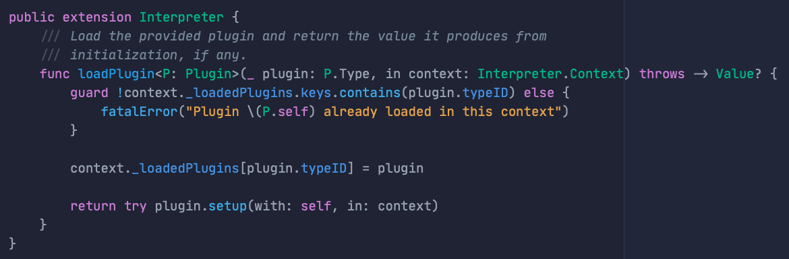
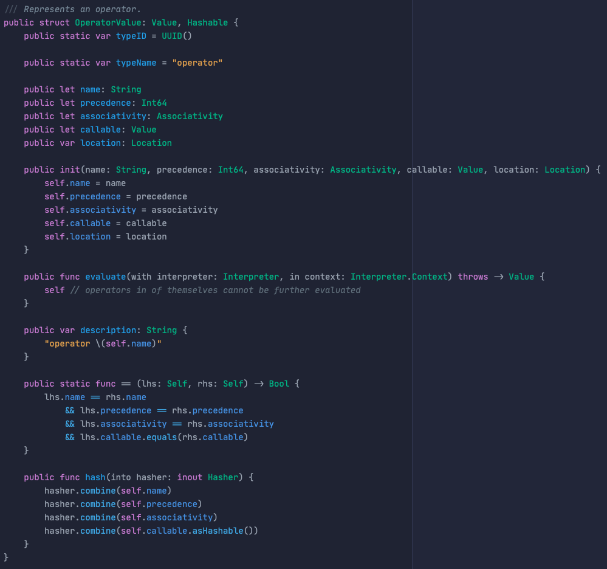

# Wonderful II

My code theme for Xcode. Similar to Atom One Dark but a bit more muted. Designed to be easy on the eyes.

## How to install

1. Quit Xcode
2. Download `Wonderful II.xccolortheme` and put it into `~/Library/Developer/Xcode/UserData/FontAndColorThemes`, creating any folders that don't already exist
3. Relaunch Xcode and open preferences
4. Select "Wonderful II" under the Themes tab

## 